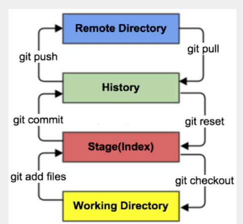
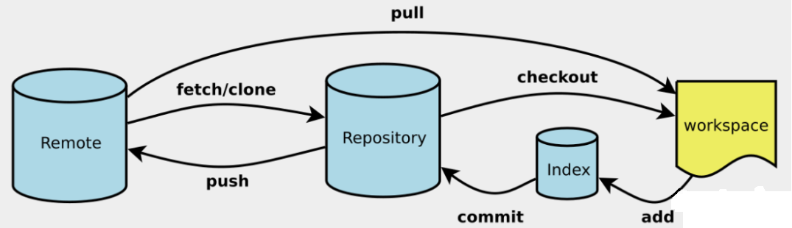

# git学习总结
git在线操作学习：https://learngitbranching.js.org

## 问题
1. 现有两个分支AB，从A合并到B，从B合并到A，这两种操作方式有什么差别，合并后是形成新的节点C，还是A和B都处于同一个节点

## 概念理解
  

## 基础操作
### 合并分支
1. git merge  
    现有两分支A和B，在A分支上将B合并过来  
    A：git merge B
2. git rebase 
    现有两分支A和B，在分支B上合并到A去  
    B: git rebase A

## 高级操作
### 在记录树中移动
1. 使HEAD指向A节点的父节点：git checkout A^
2. 使HEAD指向A节点的祖父节点：git checkout A~3
