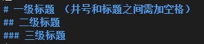
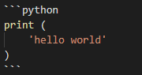
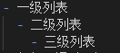
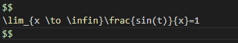

# markdown学习总结

## 语法总结

- 标题  
    
- 正文
   - 正文直接输入即可
   - 换行需空两格或回车两次  
- 代码块
   - 通过两行\```来框选，如： 
    ```
    print("hello world")
    ```
    - 在第一行跟上语言可以执行对应的语法高亮，如:  
    
    ```python
    print (
        'hello world'
    )
    ```
    - 正文中的代码通过\''框选，如：  
    打印命令为 'show ip address'
- 有序列表：与word相同，输入数字加上点和空格即可,tab缩进缩退
-  无序列表：输入-加上空格，如：  
  
- 一级列表
  - 二级列表
    - 三级列表
- 加粗：通过两组两个\*\*框选来加粗，如\*\*要加粗的\*\*,就会**加粗**了
- 倾斜：通过两组一个\*框选来倾斜，如\*要倾斜的\*，就会*倾斜*了
- 写公式：支持Latex语法,快捷键为**ctrl+M**  
    
    $$
    \lim_{x \to \infin}\frac{sin(t)}{x}=1
    $$
    文字中的公式 $\lim_{x \to \infin}f(x)$
- 表格: 可用**alt+shift+f** 格式化编辑器内的表格
    | A   | B   | C   |
    | --- | --- | --- |
    | 1   | 2   | 3   |
    | 4   | 5   | 6   |
- 链接：复制链接后选中需超链接的文字，直接粘贴即可   
    这是个[链接](https://www.bilibili.com/video/BV1si4y1472o?from=search&seid=14408233756437105348)

## 插件使用
1. paste Image：截图后 **ctrl+alt+V**